# map-lpp-price-violation-monitoring
MAP/LPP price violation monitoring using Python, web scraping, MySQL, email automation and Power BI.

## Project Overview
This project monitors advertised product prices across online marketplaces
and identifies potential MAP/LPP pricing violations.

It combines Python data processing, web scraping, MySQL database management,
automated email notifications, and Power BI reporting.

## Business Problem
Sellers may advertise products below the applicable minimum pricing threshold.
Manual monitoring makes it difficult to identify violations and track corrective actions.

## Project Objectives
- Collect and process product pricing data.
- Compare advertised prices with applicable pricing thresholds.
- Identify and analyze potential price violations.
- Track warning actions for repeated violations.
- Automate email notifications with violation details.
- Visualize violations using Power BI.

## Technologies Used
- Python
- Pandas
- Web Scraping
- MySQL
- SQL
- Power BI
- SMTP Email Automation
- Git and GitHub

## Project Structure
- `src/data_processing/` - Data cleaning and processing
- `src/database/` - Database connection and data loading
- `src/scraping/` - Web scraping files
- `src/email_automation/` - Email notifications and templates
- `notebooks/` - Data profiling and price analysis
- `sql/` - SQL scripts
- `powerbi/` - Power BI dashboard

## Violation Monitoring Workflow
1. Collect product pricing data.
2. Clean and prepare the data.
3. Compare advertised prices against applicable thresholds.
4. Identify potential violations.
5. Track warning levels and corrective actions.
6. Send email notifications.
7. Analyze results using Power BI.

## Dashboard
The Power BI dashboard provides insights into pricing violations,
marketplace performance, product categories, and seller activity.

Open the `.pbix` file in Power BI Desktop to explore the dashboard.

## Important Notes
- This is a portfolio project.
- Scraped data may be sample or demonstration data.
- Email automation should be tested with authorized recipients.
- Credentials and passwords must never be committed to GitHub.
- Follow the relevant website's terms when collecting data.

- ## Project Screenshots

### 1. Clean and Load Dataset
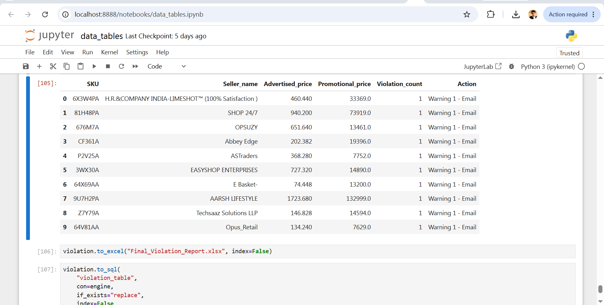

### 2. Email Automation
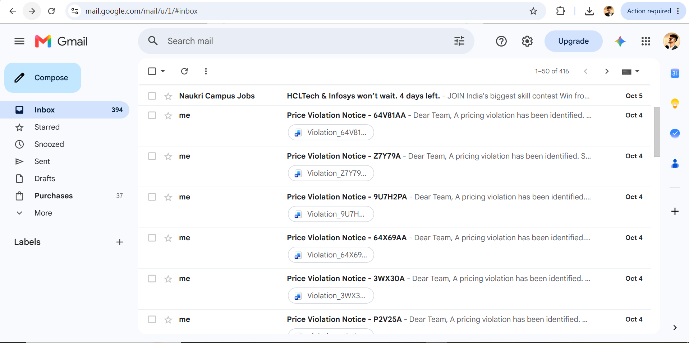

### 3. Email Violation Message
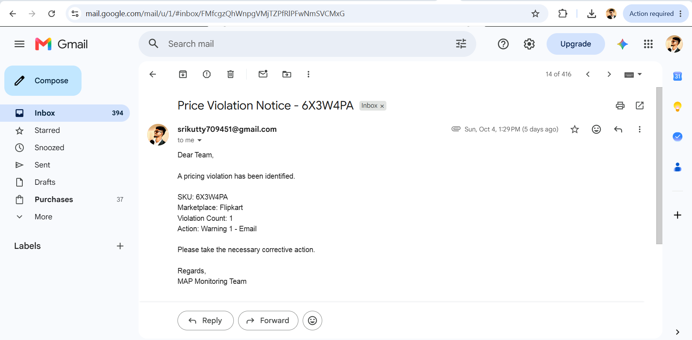

### 4. MAP/LPP Power BI Dashboard
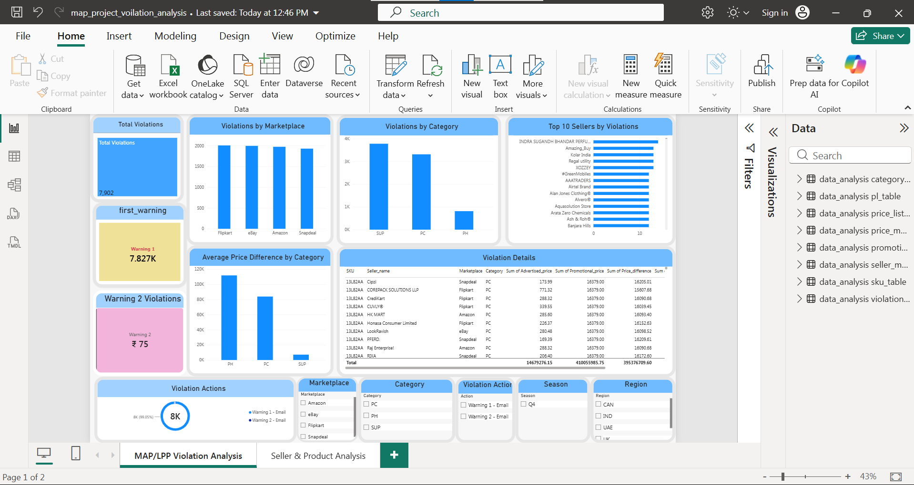

### 5. Python Data Loading
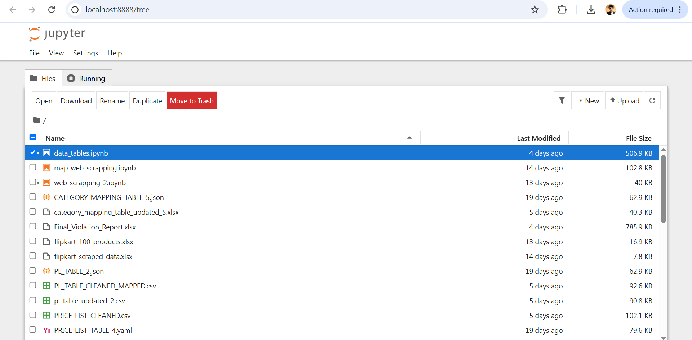

### 6. Seller and Product Analysis
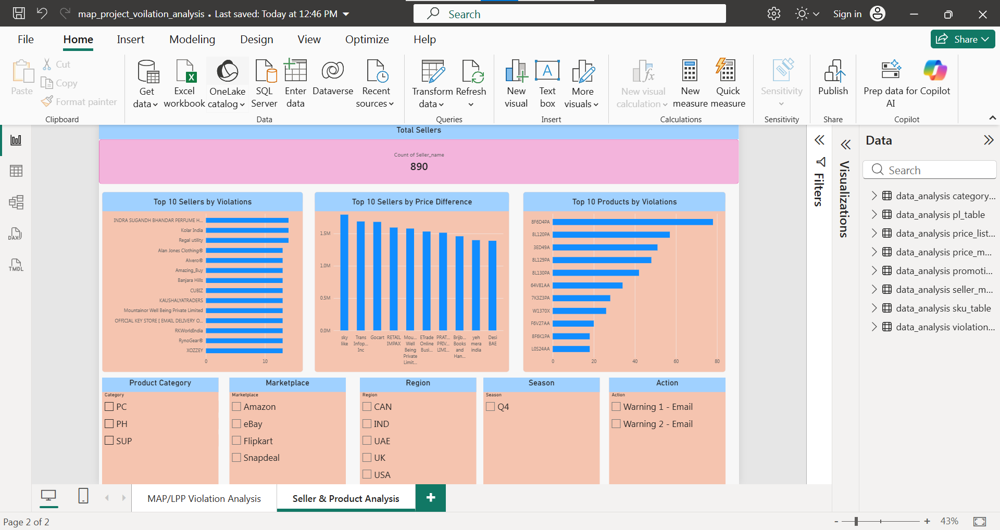

### 7. Sending 10 Demo Violation Emails
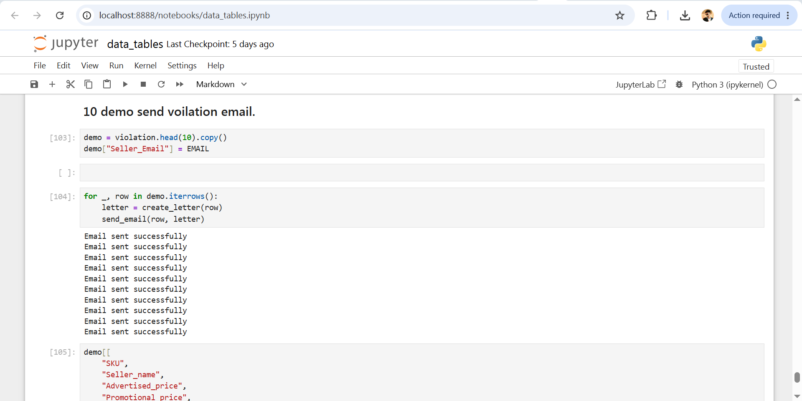

### 8. SQL Analysis
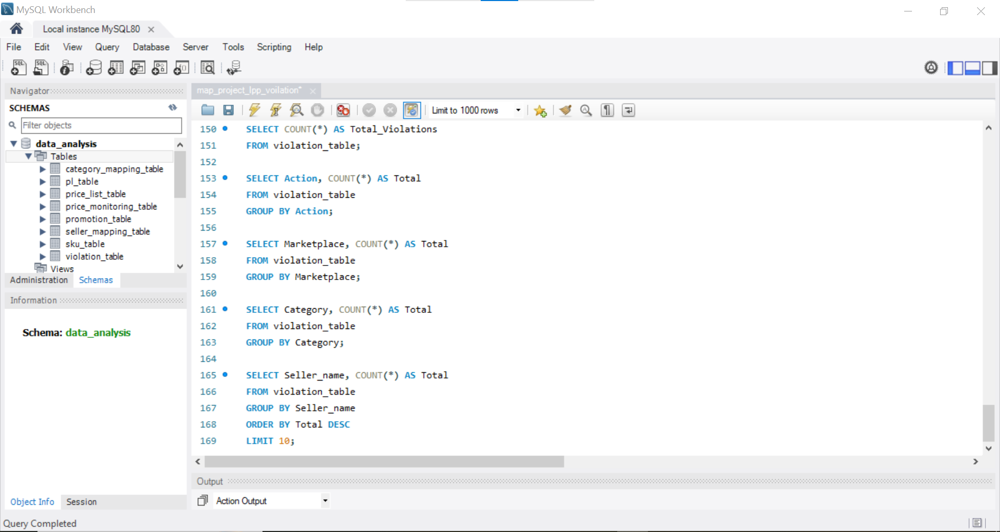

### 9. Violation Word File Attachment
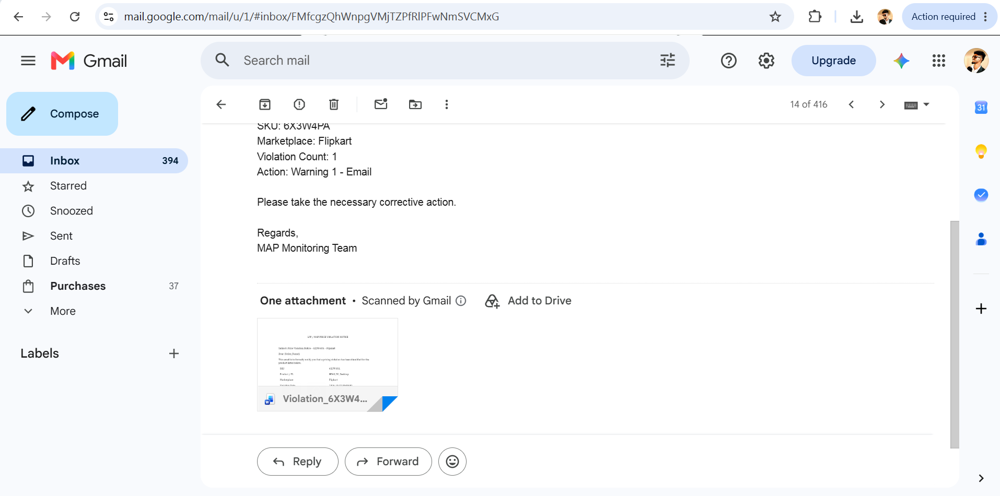

### 10. Web Scraping
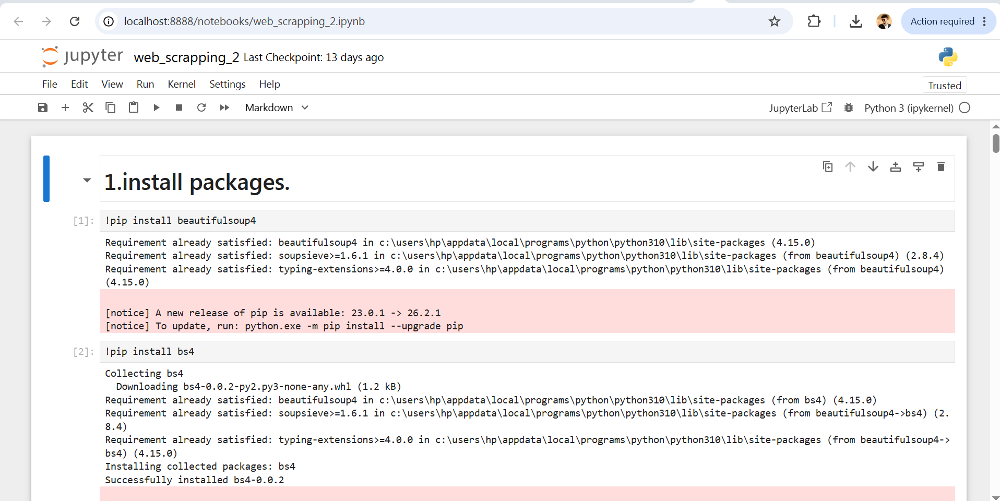

### 11. Web Scraping Dataset
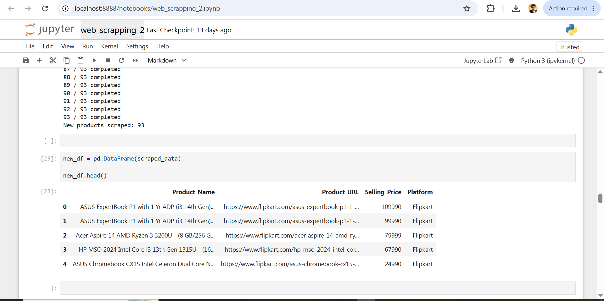

## Author
Sreeram

GitHub: https://github.com/sreeram0012003
